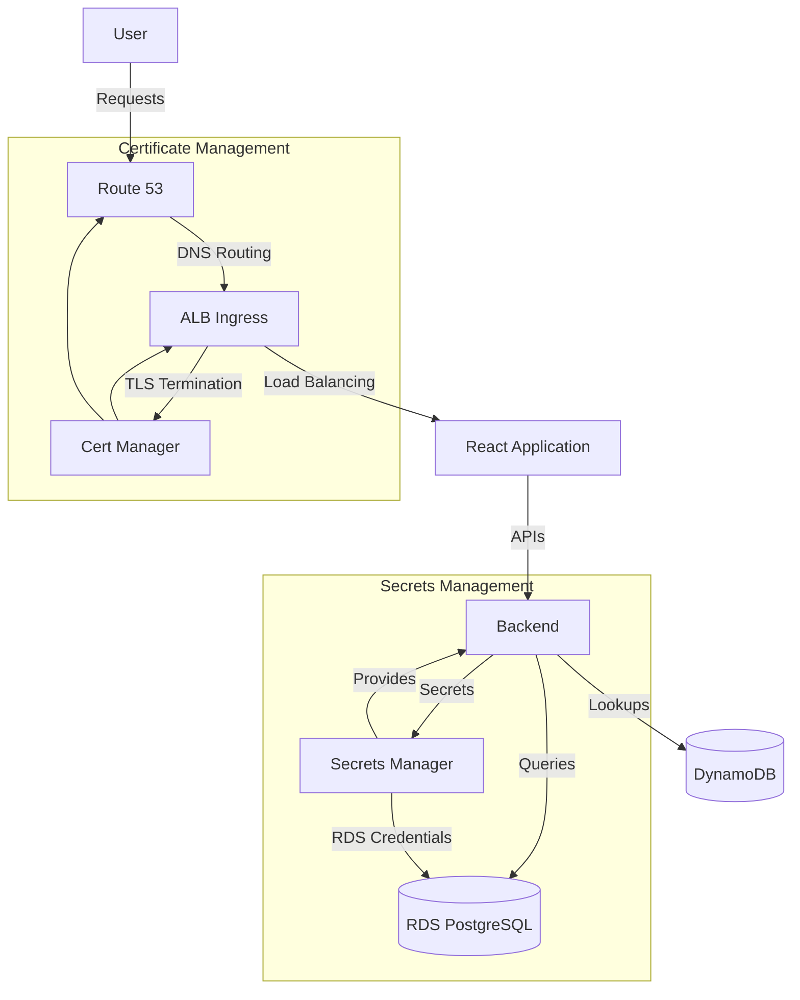
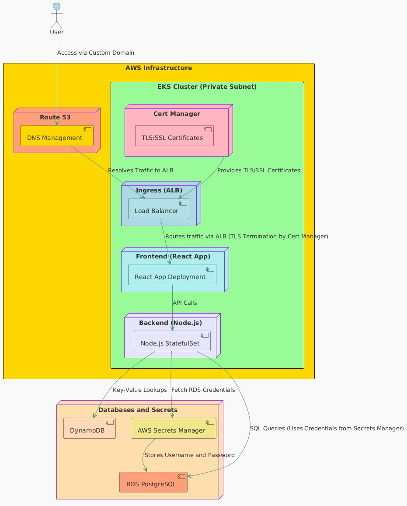

##Kubernetes
-----------------
It allows us to run containers across multiple compute nodes (these can be VMs or a bare-metal servers). <br><br>
Once Kubernetes takes control over a cluster of nodes, containers can then spun up or torn down depending upon our need at any given time.


| **Key Feature**                                      | **Description**                                                                                          |
|------------------------------------------------------|----------------------------------------------------------------------------------------------------------|
| **Continuous Development, Integration, and Deployment** | Streamlines the development lifecycle by automating build, test, and deployment processes.               |
| **Containerized Infrastructure**                    | Applications run in isolated containers, ensuring consistency and portability across environments.      |
| **Application-Centric Management**                  | Focuses on managing applications rather than individual servers or infrastructure components.           |
| **Auto-Scalable Infrastructure**                    | Automatically scales infrastructure resources up or down based on workload demands.                     |
| **Environment Consistency Across Development, Testing, and Production** | Ensures that environments remain identical, minimizing "works on my machine" issues.                     |
| **Loosely Coupled Infrastructure**                  | Each component operates independently, allowing for easier maintenance and updates.                     |
| **Higher Density of Resource Utilization**          | Optimizes resource usage by running multiple containers on the same infrastructure.                     |
| **Predictable Infrastructure**                     | Provides reliable and repeatable infrastructure deployments, reducing manual intervention.              |


##Kube-Apiserver
-----------------

| **Feature**                                         | **Description**                                                                                                                                             |
|-----------------------------------------------------|-------------------------------------------------------------------------------------------------------------------------------------------------------------|
| **Main Management Point**                          | The kube-apiserver serves as the main management point of the entire Kubernetes cluster.                                                                    |
| **Workload and Organizational Unit Configuration** | It allows users to configure Kubernetes' workloads and organizational units.                                                                                |
| **Bridge Between Components**                      | Acts as the bridge between various components to maintain cluster health.                                                                                   |
| **RESTful Interface**                              | The API server implements a RESTful interface, enabling many different tools and libraries to communicate with it.                                          |
| **Etcd Integration**                               | Responsible for ensuring that the etcd store contains service details of deployed containers.                                                               |


##Kube-Controller
-------------------

| **Feature**                                         | **Description**                                                                                                                 |
|-----------------------------------------------------|-------------------------------------------------------------------------------------------------------------------------------|
| **Manages Controllers**                            | Manages different controllers that regulate the state of the cluster.                                                         |
| **Workload Life Cycle Management**                 | Handles workload life cycles and performs routine tasks.                                                                      |
| **Replication Controller**                         | Ensures that the number of replicas defined for a pod matches the number currently deployed on the cluster.                   |
| **Desired State Fulfillment**                      | Detects changes, reads new information, and implements procedures to fulfill the desired state of the cluster.                |


##Kube-Scheduler
------------------

| **Feature**                                         | **Description**                                                                                                                 |
|-----------------------------------------------------|-------------------------------------------------------------------------------------------------------------------------------|
| **Workload Assignment**                            | Assigns workloads to specific nodes in the cluster.                                                                            |
| **Infrastructure Analysis**                        | Analyzes the current infrastructure environment and places workloads on acceptable node(s).                                    |
| **Capacity Tracking**                              | Tracks available capacity on each host to ensure workloads are not scheduled on nodes without sufficient capacity.             |

##Kubelet
---------------

| **Feature**                                         | **Description**                                                                                                                 |
|-----------------------------------------------------|-------------------------------------------------------------------------------------------------------------------------------|
| **Main Contact Point**                              | Serves as the main contact point for each node within the cluster group.                                                       |
| **Relay Information**                               | Responsible for relaying information to and from the control plane services.                                                   |
| **Etcd Interaction**                               | Interacts with the etcd store to read configuration details or write new values.                                               |
| **Cluster Authentication**                         | Communicates with the master components to authenticate to the cluster.                                                       |
| **Container Runtime Control**                      | Controls the container runtime to launch or destroy containers as needed.                                                     |
| **Workload Manifest**                              | Receives work in the form of a manifest, which defines the workload and the operating parameters.                              |

##Kube-Proxy
--------------

| **Feature**                                         | **Description**                                                                                                                 |
|-----------------------------------------------------|-------------------------------------------------------------------------------------------------------------------------------|
| **Host Subnet Management**                         | Manages individual host subnetting and ensures services are available to other components.                                     |
| **Request Forwarding**                             | Forwards requests to the correct containers.                                                                                   |
| **Load Balancing**                                 | Performs primitive load balancing and ensures the networking environment is predictable and accessible.                        |


## ConfigMaps and Secrets in Kubernetes

| **Feature**                          | **ConfigMaps**                                                                                      | **Secrets**                                                                                                    |
|--------------------------------------|-----------------------------------------------------------------------------------------------------|---------------------------------------------------------------------------------------------------------------|
| **Purpose**                          | Designed to store configuration data as key-value pairs that are not sensitive.                    | Used for storing sensitive data like passwords, keys, and tokens.                                            |
| **Sensitivity**                      | For non-sensitive information.                                                                     | Specifically for sensitive information.                                                                       |
| **Examples**                         | Environment settings, configuration files, or command-line arguments.                              | Passwords, API keys, TLS certificates.                                                                       |
| **Storage Location**                 | Stored in the etcd database.                                                                       | Stored in the etcd database and kept in `tmpfs` on the nodes.                                                |
| **Updates**                          | Updates to ConfigMaps are reflected in mounted volumes without restarting pods.                    | Pods do not automatically update when Secrets are modified; explicit updates (e.g., rolling updates) are needed. |
| **Usage**                            | - Environment variables<br>- Command-line arguments<br>- Configuration files in a volume          | - As environment variables<br>- As a volume for sensitive file-based configurations.                         |
| **Automatic Creation by Kubernetes** | Not created automatically; must be defined by the user.                                            | Kubernetes creates some Secrets automatically, such as for API access from pods.                             |
| **Transmission**                     | Transmitted to and from the API server in plain text.                                              | Transmitted in plain text to and from the API server.                                                        |
| **Security Concerns**                | Less concern for security as it handles non-sensitive data.                                        | Requires careful handling since it deals with sensitive data.                                                |
| **Dynamic Updates**                  | Updates without restarting the pods in most cases.                                                 | Requires manual updates to pods to apply changes.                                                            |


## Comparison of ABAC and RBAC in Kubernetes

| **Feature**                          | **ABAC (Attribute-Based Access Control)**                                                                                   | **RBAC (Role-Based Access Control)**                                                                          |
|--------------------------------------|----------------------------------------------------------------------------------------------------------------------------|--------------------------------------------------------------------------------------------------------------|
| **Definition**                       | Access control based on attributes associated with the request, such as user, resource, or action.                         | Access control based on roles assigned to users or groups.                                                  |
| **Configuration Method**             | Requires SSH and root filesystem access to the master VM to modify authorization policies.                                  | Configured using `kubectl` or the Kubernetes API directly.                                                   |
| **Policy Management**                | Changes to authorization policies require manual edits to configuration files on the master node.                          | Policies are managed through Kubernetes resources like `Role`, `ClusterRole`, `RoleBinding`, and `ClusterRoleBinding`. |
| **Cluster API Server Restart**       | The API server must be restarted for policy changes to take effect.                                                        | No need to restart the API server; changes are applied dynamically.                                          |
| **Delegation**                       | Cannot delegate access control management without providing SSH access to the cluster master.                              | Supports delegation of resource management by authorizing users to modify RBAC policies via RBAC itself.    |
| **Ease of Use**                      | Complex to manage, especially in dynamic environments.                                                                     | Simplified and flexible, with native support for Kubernetes resources.                                       |
| **Granularity**                      | Can be fine-grained but is harder to manage due to static file-based configurations.                                        | Granular and easier to manage using roles and bindings.                                                      |
| **Scalability**                      | Less scalable due to manual updates and dependency on master node access.                                                  | Highly scalable with dynamic configuration through the Kubernetes API.                                       |
| **Security Risks**                   | Higher risk due to direct access to the master VM and file-based policy changes.                                            | Reduced risk as no direct SSH access to the master node is required.                                         |
| **Flexibility**                      | Provides flexibility with custom attributes but is less integrated with Kubernetes tooling.                                 | Seamlessly integrated with Kubernetes and widely adopted for Kubernetes access control.                      |


Volumes and Persistent Volumes
-----------------------------------
## Persistent Volumes in Kubernetes

| **Feature**                   | **Description**                                                                                                                               |
|-------------------------------|-----------------------------------------------------------------------------------------------------------------------------------------------|
| **Definition**                | Persistent Volumes (PVs) abstract storage resources that are independent of a pod's lifecycle.                                               |
| **Purpose**                   | Provides robust, long-lasting storage for applications, unaffected by pod creation, deletion, or restarts.                                   |
| **Storage Configuration**     | Administrators configure storage resources for the cluster that can be requested and claimed by users.                                       |
| **Binding**                   | Users bind Persistent Volume Claims (PVCs) to PVs to access the storage in their pods.                                                      |
| **Decoupling from Pods**      | Storage exists independently of the pods that use it, ensuring data persistence beyond pod lifecycles.                                       |
| **Reclamation Policy**        | Determines the behavior after a pod is finished with a PV:                                                                                    |
|                               | - **Retain**: Keeps the volume until manually deleted by an administrator.                                                                   |
|                               | - **Delete**: Removes the volume and its data immediately when the pod is done using it.                                                     |
| **Flexibility**               | Supports multiple storage backends like NFS, iSCSI, cloud storage (e.g., AWS EBS, GCE Persistent Disks), and more.                          |
| **Accessibility**             | Can be accessed by one or more pods depending on the access mode (ReadWriteOnce, ReadOnlyMany, ReadWriteMany).                              |
| **Use Cases**                 | Ideal for stateful applications like databases, file systems, and other workloads requiring persistent storage.                              |
| **Administrator's Role**      | Responsible for provisioning and managing PVs, as well as configuring the appropriate reclamation policies.                                  |
| **User's Role**               | Creates Persistent Volume Claims (PVCs) to request storage resources configured as PVs.                                                     |


# PVC Type
------------

| PVC Type                    | Description                                                                                  | Use Case                                                            |
|-----------------------------|----------------------------------------------------------------------------------------------|---------------------------------------------------------------------|
| **ReadWriteOnce (RWO)**      | A volume that can be mounted by a single node for read/write access.                          | Suitable for applications that require access from only one node at a time. |
| **ReadOnlyMany (ROX)**       | A volume that can be mounted by many nodes in read-only mode.                                 | Used for shared access to data where no write operations are needed. |
| **ReadWriteMany (RWX)**      | A volume that can be mounted by many nodes for read/write access.                             | Used for applications that need shared read/write access across multiple nodes. |
| **Block Storage**            | Persistent storage with block-level access (e.g., AWS EBS, GCE Persistent Disks).            | Suitable for databases or applications requiring block storage. |
| **File Storage**             | Persistent storage with file-level access (e.g., NFS, Amazon EFS).                          | Ideal for applications that require shared file storage among multiple nodes. |
| **Ephemeral Storage (EmptyDir)** | Temporary storage that is created and destroyed along with the pod.                            | Used for temporary storage, such as cache, during pod runtime.       |

# PV Reclam Policies
-----------------------

| Reclaim Policy  | Description                                                                                  | Use Case                                                        |
|-----------------|----------------------------------------------------------------------------------------------|-----------------------------------------------------------------|
| **Retain**      | Keeps the volume and its data even after the Persistent Volume Claim (PVC) is deleted.       | Use when you want to manually manage data after PVC deletion.   |
| **Recycle**     | The volume is scrubbed (e.g., deleted files) and made available for reuse after PVC deletion. | Deprecated in Kubernetes 1.14+. Previously used for simple cleanup of data. |
| **Delete**      | Deletes the volume (e.g., from cloud storage like AWS EBS, GCE Persistent Disk) when the PVC is deleted. | Use when you want the volume to be automatically deleted along with the PVC. |


| Storage Class | Description                                                                                             | Use Case                                                       | Provisioner          |
|---------------|---------------------------------------------------------------------------------------------------------|----------------------------------------------------------------|----------------------|
| **General**   | Default storage class, typically backed by cloud provider’s default storage (e.g., AWS EBS, GCE Persistent Disk). | General-purpose storage with flexible provisioning and scaling. | cloud-provider-specific (e.g., `kubernetes.io/aws-ebs`) |
| **Local**     | Persistent storage backed by local disks on the nodes.                                                | Ideal for applications that require high-performance local storage. | `kubernetes.io/local-volume` |
| **NFS**       | A storage class that uses Network File System (NFS) for persistent storage.                             | Suitable for shared file storage across multiple pods.         | `kubernetes.io/nfs`    |
| **EBS**       | Persistent block storage from AWS Elastic Block Store (EBS), which is typically used for high-performance workloads. | Use when you need high-performance, persistent block storage.    | `kubernetes.io/aws-ebs`|
| **EFS**       | AWS Elastic File System (EFS) provides scalable, distributed file storage for Linux-based workloads.   | Best for applications requiring scalable, shared file storage across multiple instances. | `kubernetes.io/aws-efs` |


emptyDir
----------
1. It is a type of volume which is created when a Pod is first assigned to a Node.
2. It remains active as long as the Pod is running on that node.
3. The volume is initially empty and the containers in the pod can read and write the files in the emptyDir volume.
4. Once the Pod is removed from the node, the data in the emptyDir is erased.


```

# Create a Persistent Volume with the given specification
------------------------------------------------------------

Volume Name: pv-log

Storage: 100Mi

Access Modes: ReadWriteMany

Host Path: /pv/log

Reclaim Policy: Retain


apiVersion: v1
kind: PersistentVolume
metadata:  
  name: pv-log
spec:
  capacity:
    storage: 100Mi
  accessModes:
    - ReadWriteMany
  persistentVolumeReclaimPolicy: Retain  
  hostPath:
    path: /pv/log


Let us claim some of that storage for our application.
Create a Persistent Volume Claim with the given specification.

Persistent Volume Claim: claim-log-1

Storage Request: 50Mi

Access Modes: ReadWriteOnce


apiVersion: v1
kind: PersistentVolumeClaim
metadata:  
  name: claim-log-1
spec:
  
  accessModes:
    - ReadWriteMany
  resources:
    requests:
      storage: 50Mi


Update the webapp pod to use the persistent volume claim as its storage.


Replace hostPath configured earlier with the newly created PersistentVolumeClaim


apiVersion: v1
kind: Pod
metadata:
  name: webapp
  namespace: default
spec:
  containers:
  - env:
    - name: LOG_HANDLERS
      value: file
    image: kodekloud/event-simulator
    imagePullPolicy: Always
    name: event-simulator
    volumeMounts:
    - mountPath: /log
      name: log
  volumes:
  - name: log
    hostPath: 
      path: /var/log/webapp
      type: Directory   


     volumeMounts:
    - mountPath: /log
      name: log

 volumes:
  - name: log
    persistentVolumeClaim:
      claimName: claim-log-1


```


Service
---------

1. Service is an abstract way to expose a set of pods (one or more) as a network service
2. It provides a consistent and stable endpoint (usually an IP address and port) to access the pods
3. Abstraction Layer: Services act as an abstraction layer that allows you to refer to a group of pods collectively by a single, stable DNS name or IP address
4. Selectors: Services use label selectors to determine which pods should be part of the service.


| **Service Type**          | **Description**                                                                                                                               |
|---------------------------|---------------------------------------------------------------------------------------------------------------------------------------------|
| **ClusterIP**             | Services are reachable by pods/services within the cluster. A predictable static DNS address is created for the service in the default namespace. |
| **NodePort**              | Services are reachable by clients on the same LAN or clients who can ping the Kubernetes host nodes. For security, Kubernetes host nodes should be on a private subnet. |
| **LoadBalancer**          | Services are reachable by everyone connected to the internet. Typically, the L4 load balancer is publicly accessible, while Kubernetes host nodes remain on a private subnet. |
| **Headless Service**      | Services without a cluster IP. Used for direct pod-to-pod communication with a custom DNS configuration.                                      |


Daemon Sets
--------------
1. Specialized form of pod controller which run a copy of a pod on each node in the cluster
2. Collecting and forwarding logs, aggregating metrics, and running services that increase the capabilities of the node itself are popular candidates for daemon sets


Statefulset
-------------

| **Feature**                     | **Description**                                                                                                                     |
|---------------------------------|-------------------------------------------------------------------------------------------------------------------------------------|
| **Stateful Workloads**          | Designed for managing stateful applications that require stable and unique network identifiers, persistent storage, and ordered deployment and scaling. |
| **Stable Network Identity**     | Maintains a stable network identity (hostname) for each pod, enabling consistent communication between stateful application components. |
| **Persistent Storage**          | Provides support for persistent storage volumes, ensuring data is retained across pod restarts or rescheduling.                    |
| **Ordered Deployment and Scaling** | Deploys and scales pods in a specific order, ensuring each pod is fully initialized and ready before the next one is created.          |


Deployment
------------

| **Feature**                     | **Description**                                                                                                                     |
|---------------------------------|-------------------------------------------------------------------------------------------------------------------------------------|
| **Stateless Workloads**         | Designed for managing stateless applications that can scale horizontally and do not require stable network identities or persistent storage. |
| **Horizontal Scaling**          | Enables automatic scaling of application pods based on resource utilization or user-defined metrics to handle increased traffic and demand. |
| **Rolling Updates**             | Supports rolling updates to update applications gradually without causing downtime or service disruption.                         |
| **Pod Template Specification**  | Defines a pod template specification to specify the desired state of application pods, including container images, resource requirements, and environment variables. |


Stateless Applications
-----------------------

| **Feature**                     | **Description**                                                                                                                     |
|---------------------------------|-------------------------------------------------------------------------------------------------------------------------------------|
| **Session Overhead Removal**    | Removes the overhead of creating or using sessions.                                                                                 |
| **Horizontal Scaling**          | Facilitates horizontal scaling by adding or removing application instances on demand.                                               |
| **Application Consistency**     | Ensures consistency across various application instances.                                                                           |
| **Reduced Memory Usage**        | Minimizes memory usage on the server-side.                                                                                          |
| **Eliminates Session Expiry**   | Avoids issues related to session expiry.                                                                                            |
| **Deployment Support**          | Stateless applications can be deployed efficiently using Deployments.                                                               |


Statefulsets
--------------

| **Feature**                         | **Description**                                                                                                                     |
|-------------------------------------|-------------------------------------------------------------------------------------------------------------------------------------|
| **State Preservation**              | Used when you need to preserve the state of the application.                                                                        |
| **Volume Claim Templates**          | StatefulSets use volume claim templates/claims of persistent volumes to keep the state safe in case of crashes or restarts.          |
| **Faster Application**              | Stateful applications don’t need to call the database a second time as session info is stored on the server, making it faster.     |
| **Ordering and Uniqueness**         | Offers ordering and uniqueness, ensuring specific deployment order and identity for pods.                                          |
| **Data-Oriented Applications**      | Associated with data-oriented applications (e.g., databases) that need access to the same volumes even if rescheduled to a new node. |
| **Special Deployment Requirements** | Meets special requirements related to deployment ordering, persistent data, or stable networking.                                 |


| **Parameter**     | **Description**                                               |
|-------------------|---------------------------------------------------------------|
| **maxSurge**      | The maximum number of new pods that will be created at a time. |
| **maxUnavailable**| The maximum number of old pods that will be deleted at a time.|

ReplicationController VS ReplicaSet
-------------------------------------

1. Both of them ensure that a specified number of pod replicas are running at any given time
2. The difference comes with the usage of selectors to replicate pods
3. Replication is used for the core purpose of Reliability, Load Balancing, and Scaling.


| **Attribute**                           | **ReplicaSet**                                         | **ReplicationController**                               |
|-----------------------------------------|-------------------------------------------------------|--------------------------------------------------------|
| **Label Selector**                      | Uses equality-based requirement for matching labels in the matchLabels field. | Uses the set-based requirement for matching labels in the selector field. |
| **API Group**                           | Belongs to the `apps/v1` API group.                   | Belongs to the `v1` API group.                         |
| **Pod Selection**                       | Supports the use of the `matchLabels` and `matchExpressions` fields for selecting pods. | Supports only the `selector` field for pod selection.   |
| **Rolling Updates Control**             | Allows fine-grained control over rolling updates with features like `maxUnavailable` and `maxSurge`. | Supports a basic rolling update strategy with `rollingUpdate`. |


| **Command**    | **Description**                                                                                     | **Effect**                                                                                           | **Use Case**                                                                                                                                      |
|----------------|-----------------------------------------------------------------------------------------------------|-----------------------------------------------------------------------------------------------------|--------------------------------------------------------------------------------------------------------------------------------------------------|
| **cordon**     | Marks a node as unschedulable, preventing new pods from being scheduled on it.                       | New pods will not be scheduled on the node, but existing pods continue running.                      | Useful when performing maintenance or upgrades on a node without affecting the running pods.                                                      |
| **uncordon**   | Marks a node as schedulable again, allowing new pods to be scheduled on it.                           | Node becomes schedulable again, allowing the scheduler to place new pods on the node.                | Used after maintenance or upgrades to bring the node back into service and allow new pods to be scheduled.                                        |
| **drain**      | Evicts all pods from the node (except mirror pods) and marks the node as unschedulable.              | Existing pods are gracefully terminated and rescheduled onto other nodes. Node becomes unschedulable. | Useful before performing maintenance or upgrades on a node, ensuring no pods are running during the process.                                      |

| **Step** | **Description**                                                                                          |
|----------|----------------------------------------------------------------------------------------------------------|
| **1.**   | Taints apply at node level, allowing a node to repel a set of pods.                                       |
| **2.**   | Tolerations are applied to pods, and allow the pods to schedule onto nodes with matching taints.         |
| **3.**   | Taints and tolerations work together to ensure that pods are not scheduled onto inappropriate nodes.      |
| **4.**   | Taints and tolerations are only meant to restrict nodes to accept certain pods.                           |


## NodeSelector vs Affinity vs Anti-Affinity

| **Aspect**           | **NodeSelector**                                              | **Affinity**                                                     | **Anti-Affinity**                                                 |
|----------------------|---------------------------------------------------------------|------------------------------------------------------------------|------------------------------------------------------------------|
| **Purpose**           | Ensures pods are scheduled on specific nodes based on labels. | Allows more flexible rules to control pod placement using expressions. | Ensures pods are not scheduled on nodes with specific conditions. |
| **Syntax**            | Uses simple key-value pair syntax.                           | Uses a more expressive and flexible set of rules with operators. | Similar to affinity, but negates pod placement.                  |
| **Granularity**       | Basic and rigid; only supports exact matches on node labels. | More granular; supports soft (preferred) or hard (required) constraints. | More granular; allows specifying "required" or "preferred" constraints for anti-affinity rules. |

## requiredDuringSchedulingIgnoredDuringExecution vs preferredDuringSchedulingIgnoredDuringExecution

| **Aspect**                          | **requiredDuringSchedulingIgnoredDuringExecution**                            | **preferredDuringSchedulingIgnoredDuringExecution**                          |
|-------------------------------------|----------------------------------------------------------------------------|----------------------------------------------------------------------------|
| **Behavior**                        | Specifies hard constraints that must be met for scheduling the pod. If the conditions are not met, the pod will not be scheduled. | Specifies soft constraints. The scheduler will try to meet the conditions, but the pod can still be scheduled if they are not met. |
| **Impact on Scheduling**            | The pod cannot be scheduled if the required conditions are not satisfied.   | The pod can still be scheduled even if the preferred conditions are not fully met. |


## Labels vs Annotations

| **Aspect**            | **Labels**                                                | **Annotations**                                             |
|-----------------------|-----------------------------------------------------------|-------------------------------------------------------------|
| **Purpose**           | Attach semantic tags to objects, marking them as part of a group. | Attach arbitrary key-value information to objects.         |
| **Use Case**          | Used by services to route traffic requests to backend pods. | Used for storing less structured data, such as metadata.   |
| **Format**            | Key-value pairs.                                          | Key-value pairs, but more flexible and free-form.           |
| **Multiplicity**      | Each unit can have multiple labels, but only one entry per key. | Can have multiple annotations for each object.             |
| **Storage**           | Typically used for grouping or organizing objects in a meaningful way. | Used for attaching additional, often non-critical data.    |
| **Length and Size**   | Labels are typically short, with a strict format.         | Annotations can be longer and more detailed.               |
| **Efficiency**        | Lightweight, used for identifying and selecting objects for grouping. | Can store larger amounts of data, typically non-critical.  |


K8s Terms
-----------

| **Term**                | **Description**                                                                                                                  |
|-------------------------|----------------------------------------------------------------------------------------------------------------------------------|
| **Pod**                 | The basic unit of deployment in Kubernetes. A pod is a collection of related Docker containers that need to coexist.            |
| **Containers**          | Docker containers are lightweight virtual machines, and also act as a software packaging and delivery platform.                  |
| **Docker Compose**      | A file that defines services (containers) for communication. It is inherently non-distributed and typically used for local setups. |
| **Headless Service**    | A service without a ClusterIP, allowing direct communication with pods without going through a proxy.                            |


Pod Lifecycle
---------------

| **Pod State**     | **Description**                                                                                                                     |
|-------------------|-------------------------------------------------------------------------------------------------------------------------------------|
| **Pending**       | The Pod has been accepted by the Kubernetes system, but one or more container images have not been created. Includes time before scheduling and image downloads. |
| **Running**       | The Pod has been bound to a node, and all containers are created. At least one container is running, or in the process of starting or restarting. |
| **Succeeded**     | All containers in the Pod have terminated successfully and will not be restarted.                                                   |
| **Failed**        | All containers in the Pod have terminated, and at least one container has failed (exited with a non-zero status or terminated by the system). |
| **Unknown**       | The state of the Pod could not be obtained, typically due to a communication error with the host.                                    |
| **Waiting**       | Default state. If the container is not in Running or Terminated state, it is in Waiting. The container is still running required operations like pulling images or applying secrets. |
| **Evicted**       | The Pod was evicted due to resource shortages like insufficient memory, unavailable nodes, or image unavailability. This occurs due to Kubernetes limits and requests. |


Image pull policy overview
-----------------------------


| **Restart Policy** | **Description**                                                                                                                     |
|--------------------|-------------------------------------------------------------------------------------------------------------------------------------|
| **Always**         | The container will be restarted regardless of the exit code (even if it exited with a zero exit code). Useful for ensuring the container is always running, such as for a web server. |
| **OnFailure**      | The container will be restarted only if it exited with a non-zero exit code (indicating an error). Useful when ensuring a task completes successfully and needs retrying on failure. |
| **Never**          | The container will not be restarted regardless of why it exited.                                                                    |


## Probes
-----------


| **Probe Type**     | **Description**                                                                                                                     |
|--------------------|-------------------------------------------------------------------------------------------------------------------------------------|
| **livenessProbe**   | Indicates whether the container is running. If it fails, the kubelet kills the container, and the container is restarted according to its restart policy. Default state is Success if no probe is provided. |
| **readinessProbe**  | Indicates whether the container is ready to serve requests. If it fails, the endpoints controller removes the Pod’s IP address from all Services that match the Pod. |
| **startupProbe**    | Indicates whether the application inside the container has started. All other probes are disabled until it succeeds. If it fails, the kubelet kills the container, and it is restarted according to the restart policy. |

## K8s Errors
---------------


| **Status**                           | **Description**                                                                                              |
|--------------------------------------|--------------------------------------------------------------------------------------------------------------|
| **Pod Eviction**                     | Pods being evicted due to resource constraints, such as memory or CPU limits being exceeded.                 |
| **ImagePullBackOff**                 | Pods failing to start due to issues pulling container images from the specified repository.                   |
| **CrashLoopBackOff**                 | Pods repeatedly crashing and restarting due to application errors or misconfigurations.                       |
| **NodeNotReady**                     | Nodes being marked as not ready due to various reasons, such as network connectivity issues or resource exhaustion. |
| **ErrorCreatingPodSandBox**          | Issues with creating the network namespace for a pod, often caused by networking plugins or misconfigurations. |
| **PersistentVolumeClaimNotFound**    | Pods failing to start due to issues with accessing PersistentVolumeClaims (PVCs), typically caused by misconfigured storage classes or insufficient storage capacity. |
| **ServiceUnavailable**               | Services being unavailable due to issues with endpoints or connectivity between pods.                        |
| **InvalidConfiguration**             | Errors related to invalid configurations in Kubernetes resources, such as Pods, Deployments, or Services.    |
| **API Server Errors**                | Errors related to the Kubernetes API server, such as timeouts, authentication failures, or resource constraints. |
| **ResourceQuotaExceeded**            | Workloads failing to start or being throttled due to exceeding resource quotas defined in the cluster.       |


## Deployment Strategy
------------------------

| **Strategy**        | **Description**                                                                 | **Deployment Flow**                                                                                                  | **Risk Level**           | **Use Cases**                                                                                          |
|---------------------|---------------------------------------------------------------------------------|-----------------------------------------------------------------------------------------------------------------------|--------------------------|--------------------------------------------------------------------------------------------------------|
| **Blue-Green**      | A deployment strategy where two environments (Blue and Green) are used. Only one environment (Blue) is live at a time. The new version is deployed to the Green environment, then traffic is switched to Green. | Blue is live, Green has the new version. Once Green is tested, traffic switches from Blue to Green.                    | Low, as rollback is easy | Ideal for large applications where a quick rollback is needed, or when the new version is significantly different. |
| **Canary**          | Gradually rolling out the new version to a small subset of users (the "canary") and monitoring for issues before full deployment. | Deploy to a small percentage of traffic, monitor, then gradually increase the rollout to the rest of users.           | Medium, due to gradual rollout | Useful when changes need to be tested with real user traffic or in cases where the new version may have unforeseen issues. |
| **A/B Testing**     | Two different versions of a feature or application are deployed, and user traffic is split between them to compare performance. | Traffic is split between two or more variants, results are analyzed, and the better-performing variant is selected.    | Medium, based on the complexity of changes | Best for comparing different features or versions of a service or product, especially in marketing and user experience testing. |
| **Recreate**        | The old version of the application is terminated before the new version is deployed, ensuring no overlap. | The current application is stopped, and the new application version is deployed from scratch.                        | High, as downtime is involved | Suitable for environments where downtime is acceptable, and the application is easy to redeploy. |
| **Rolling Update**  | Gradually replaces instances of the old version with the new version without downtime, ensuring that some instances are always available. | The old pods are replaced one by one by the new pods, ensuring minimal downtime during the update.                    | Low to Medium, based on configuration | Ideal for applications that require high availability during updates, with minimal downtime or service disruption. |


## Comparison of Namespace Selector, IP Selector, and Pod Selector

| **Aspect**                | **Namespace Selector**                                                | **IP Selector**                                                      | **Pod Selector**                                                      |
|---------------------------|-----------------------------------------------------------------------|---------------------------------------------------------------------|---------------------------------------------------------------------|
| **Purpose**                | Selects resources within specific namespaces.                         | Selects resources based on the IP addresses of the pods or nodes.    | Selects resources based on labels assigned to pods.                  |
| **Command/Usage**          | Used in Network Policies to select namespaces.                       | Used in network policies or services to select resources by IP.      | Used in services, deployments, or network policies to select pods.    |
| **Example**                | `namespaceSelector: {matchLabels: {env: production}}`                 | `ipBlock: {cidr: "10.0.0.0/24", except: ["10.0.0.5/32"]}`           | `podSelector: {matchLabels: {app: myapp}}`                           |
```
spec:
  ingress:
  - from:
    - podSelector:
        matchLabels:
          name: internal
    ports:
    - port: 8080
      protocol: TCP
  podSelector:
    matchLabels:
      name: payroll
  policyTypes:
  - Ingress
  
 Create a network policy to allow traffic from the Internal application only to the payroll-service and db-service. 
  
  apiVersion: networking.k8s.io/v1
kind: NetworkPolicy
metadata:
  name: internal-policy
  
spec:
  podSelector:
    matchLabels:
      name: internal
  policyTypes:
  - Egress
  - Ingress
  ingress:
    - {}
  egress:
  - to:
    - podSelector:
        matchLabels:
          name: mysql
    ports:
    - port: 3306
      protocol: TCP
  - to:
    - podSelector:
        matchLabels:
          name: payroll
    ports:
     - port: 8080
       protocol: TCP
  - ports:
    - port: 53
      protocol: TCP
    - port: 53
      protocol: UDP

```

CASE-01
---------
| **Step** | **Question**                                                       | **Answer**                                                                                          |
|----------|--------------------------------------------------------------------|-----------------------------------------------------------------------------------------------------|
| **1.**   | **Creating a Service and Discovering DNS Names in Kubernetes**     | Create an nginx deployment and expose it via a service to perform DNS queries.                     |
| **2.**   | **How to create an nginx deployment using the latest nginx image?**| `kubectl create deployment nginx --image=nginx:latest`                                              |
| **3.**   | **How to verify that the nginx deployment has been created successfully?** | `kubectl get deployments` or `kubectl describe deployment nginx`                                  |
| **4.**   | **How to create a service from the nginx deployment?**             | `kubectl expose deployment nginx --port=80 --target-port=80 --name=nginx-service`                 |
| **5.**   | **How to verify that the service has been created successfully?**  | `kubectl get services` or `kubectl describe service nginx-service`                                |
| **6.**   | **How to create a pod to perform the DNS query?**                  | `kubectl run dns-query-pod --image=busybox --restart=Never --command -- sleep 3600`                |
| **7.**   | **How to verify that the pod has been created successfully?**      | `kubectl get pods` or `kubectl describe pod dns-query-pod`                                         |
| **8.**   | **How to perform the DNS query to the service?**                   | `kubectl exec dns-query-pod -- nslookup nginx-service`                                             |
| **9.**   | **How to record the DNS name of the service?**                     | The DNS name will be `nginx-service.<namespace>.svc.cluster.local`. Record it for future reference. |


CASE-02
---------

| **Step** | **Command**                                                                 | **Description**                                                                                          |
|----------|-----------------------------------------------------------------------------|----------------------------------------------------------------------------------------------------------|
| **1. Create Deployment (no resources)**                                      | `kubectl create deployment nginx-deploy --image=nginx:1.16 --dry-run=client -o yaml > deploy.yaml`         | Creates a deployment YAML file without creating resources in the cluster.                                  |
| **2. Apply Deployment**                                                      | `kubectl apply -f deploy.yaml --record`                                                                  | Applies the deployment to the cluster and records the rollout history.                                    |
| **3. Check Rollout History**                                                 | `kubectl rollout history deployment nginx-deploy`                                                        | Displays the rollout history of the `nginx-deploy` deployment.                                            |
| **4. Update Deployment Image**                                               | `kubectl set image deployment/nginx-deploy nginx=nginx:1.17 --record`                                    | Updates the deployment to use the `nginx:1.17` image and records the change.                             |
| **5. Display Updated Rollout History**                                       | `kubectl rollout history deployment nginx-deploy`                                                        | Displays the updated rollout history of the `nginx-deploy` deployment after the image update.            |
| **6. Rollback to Previous Version**                                          | `kubectl rollout undo deployment/nginx-deploy --to-revision=1`                                           | Rolls back the deployment to the previous version (nginx:1.16).                                           |


COREDNS
-----------


| **Feature**                                                        | **Description**                                                                                                                     |
|--------------------------------------------------------------------|-------------------------------------------------------------------------------------------------------------------------------------|
| **Multi-threaded Design**                                           | CoreDNS leverages Go for a multi-threaded design, allowing efficient DNS resolution.                                                |
| **Negative Caching**                                                | CoreDNS supports negative caching, meaning it caches failed DNS queries as well as successful ones, which improves overall resolution speed and helps with external lookups. |
| **Lower Memory Requirement**                                        | CoreDNS has a lower memory requirement, making it suitable for clusters with smaller worker nodes.                                    |
| **Single Process (Written in Go)**                                  | CoreDNS is a single process written in Go, simplifying its architecture.                                                           |
| **Containerized DNS Resolution**                                    | A single container handles DNS query resolution, caching, health checks, and metrics.                                               |
| **Round-Robin Load Balancing**                                      | CoreDNS enhances DNS-based round-robin load balancing by randomizing the order in which it returns certain records.                 |
| **Autopath**                                                        | CoreDNS features autopath, which improves DNS response times for external hostnames by optimizing the iteration through search domain suffixes in `resolv.conf`. |


Create vs Apply
-----------------

| **Command**         | **Description**                                                                                                                     |
|---------------------|-------------------------------------------------------------------------------------------------------------------------------------|
| **kubectl create**   | An imperative command used to create resources by specifying all the details in the command itself. It will throw an error if the resource already exists. |
| **kubectl apply**    | A declarative command used to apply a configuration file describing the desired state of a resource. It can create or update a resource, and it merges the current state with the desired state. |


Docker Terms
----------------


| **Command**          | **Description**                                                                                                                     |
|----------------------|-------------------------------------------------------------------------------------------------------------------------------------|
| **docker create**     | Creates a new container based on the specified image and configuration but does not start it immediately. The container is left in a stopped state. |
| **docker run**        | Creates and starts a new container based on the specified image, combining the `docker create` and `docker start` steps into a single command. |
| **docker attach**     | Connects to the main process of a running container, useful for interactive sessions with the main process. Does not allow running arbitrary commands. |
| **docker exec**       | Runs a command inside a running container, providing more flexibility for executing various commands. |


Horizontal Scaling vs Vertical Scaling
----------------------------------------

| **Scaling Type**          | **Description**                                                                                          |
|---------------------------|----------------------------------------------------------------------------------------------------------|
| **Vertical Scaling**       | Helps to scale compute power such as CPU and Memory to your existing machine.                             |
| **Horizontal Scaling**     | Involves increasing the number of nodes and distributing the tasks among different nodes.                |


Why are both Kube-DNS and CoreDNS installed by default?
--------------------------------------------------------
The reason for this is that kube-dns service is considered to be something that application depend on, so it remained unchanged when CoreDNS was introduced. It is by design.
If you check, you will see that kube-dns service points at CoreDNS pods. 
Take a look at the label selector it uses and run that selector against pods in the same namespace
kubectl describe -n kube-system service/kube-dns


Create Horizontal Pod Autoscaler
https://kubernetes.io/docs/tasks/run-application/horizontal-pod-autoscale-walkthrough/#create-horizontal-pod-autoscaler
kubectl autoscale deployment php-apache --cpu-percent=50 --min=1 --max=10

| **Attribute**              | **INIT Containers**                                              | **Sidecar**                                                      |
|----------------------------|------------------------------------------------------------------|------------------------------------------------------------------|
| **Execution Order**         | Starts and executes before other containers in the same Pod.     | Runs alongside the main application container in the same Pod.  |
| **Shared Resources**        | Shares the same volume and network as the main container.        | Shares the same volume and network as the main container.       |
| **Purpose**                 | Performs tasks before the rest of the pod is deployed.           | Used for auxiliary tasks such as log shipping, log watching, or monitoring. |
| **Completion Requirement**  | Each Init Container must complete successfully before the next one starts. | Not required to complete before other containers, runs concurrently. |
| **Common Use Cases**        | Task initialization before the main application container starts. | Log shippers, monitoring agents.                               |


| **Attribute**         | **COPY**                                        | **ADD**                                          |
|-----------------------|-------------------------------------------------|--------------------------------------------------|
| **Basic Function**     | Only supports basic copying of local files into the container. | Supports local tar file auto extraction and remote URL support. |
| **Use Case**           | Simple file copying from host to container.    | Can copy files and also handle tar extraction and fetching from remote URLs. |


| **Attribute**          | **ATTACH**                                        | **EXEC**                                          |
|------------------------|---------------------------------------------------|---------------------------------------------------|
| **Function**            | Connects the standard input/output/error of the main process (PID 1) inside the container to the terminal. | Executes a new command or creates a new process in the container's environment. |
| **Main Process**        | Attaches to the process that runs in the container with PID 1. | Runs a new process within the container, independent of PID 1. |
| **Features**            | Directly connects to the main container process, useful for interacting with the existing process. | Allows you to run a process as a different user and provides various other features. |
| **Use Case**            | Used to interact with the main process inside the container. | Used to execute commands in a running container without exiting the container. |


## Comparison of docker export, docker save, and docker commit

| **Aspect**                 | **docker export**                                          | **docker save**                                              | **docker commit**                                              |
|----------------------------|-----------------------------------------------------------|-------------------------------------------------------------|---------------------------------------------------------------|
| **Purpose**                 | Exports the filesystem of a container as a tarball.       | Saves an image to a tarball file for distribution or backup. | Creates a new image from a container's changes.                |
| **Command**                 | `docker export <container_id> > <filename>.tar`           | `docker save -o <filename>.tar <image_name>`                 | `docker commit <container_id> <new_image_name>`                |
| **Data Included**           | Only includes the filesystem of the container (no metadata or history). | Includes the image layers, metadata, and tags.               | Captures the changes made to a container, including files and environment variables. |


ENTRYPOINT VS CMD
------------------

| **Attribute**                             | **ENTRYPOINT**                                          | **CMD**                                               |
|-------------------------------------------|---------------------------------------------------------|-------------------------------------------------------|
| **Purpose**                               | Invoke executable service when the container is started. | Specifies the arguments which get passed to the ENTRYPOINT. |
| **Command Line Overwrite**                | Command and parameters will not be overwritten from the command line. | Default command and/or parameters, which can be overwritten from the command line. |
| **Syntax Example**                        | `ENTRYPOINT ["executable"]`                             | `CMD ["executable", "arg1", "arg2"]`                   |


| **Network Type** | **Overlay**                                                       | **Bridge**                                                      | **Hostonly**                                                   |
|------------------|-------------------------------------------------------------------|-----------------------------------------------------------------|---------------------------------------------------------------|
| **Description**  | Connects containers across multiple hosts (nodes) over a virtual network. | Connects containers on a single host through an internal bridge. | Isolates virtual machines from the outside network; only accessible from the host. |
| **Use Case**     | Multi-host networking for distributed applications.              | Basic container communication on the same host.                | Local testing and development; isolated VMs.                  |
| **IP Assignment**| Each container gets a unique IP on the overlay network.           | Containers share the host’s bridge network subnet.              | Each VM receives an IP in the host-only subnet.                |
| **External Access** | Requires routing or a gateway for external access.             | Limited; needs port forwarding for external access.             | No direct external access; requires NAT for host internet.    |


| **Network Type**      | **Description**                                                                 |
|-----------------------|---------------------------------------------------------------------------------|
| **Bridge Network**     | Connects containers on the same host.                                           |
|                       | Uses Linux bridge for container networking within a host.                       |
|                       | High performance with low latency since it's host-local.                        |
|                       | IPs are typically assigned from the host's local subnet.                        |
| **Overlay Network**    | Connects containers across multiple hosts.                                      |
|                       | Uses VXLAN tunneling for communication between hosts.                           |
|                       | Lower performance than bridge networks due to overhead from tunneling.          |
|                       | IPs are allocated from a network pool spanning multiple hosts.                  |


# Pause Container: Explanation and Features

| **Feature**                | **Description**                                                                                          |
|----------------------------|----------------------------------------------------------------------------------------------------------|
| **Pod Namespace Holder**   | The pause container holds and maintains the shared Linux namespaces (e.g., PID, IPC, Network, and UTS) for all containers in a Pod. |
| **Resource Allocation**    | Acts as a placeholder to allocate and manage network resources (like IP addresses) for the Pod.          |
| **Networking Bridge**      | Sets up and maintains the Pod's network namespace, enabling communication between containers over `localhost`. |
| **Lightweight Design**     | The pause container is minimal, consuming very little CPU or memory, typically running a process like `sleep infinity`. |

---

## Why Use a Pause Container?

| **Reason**                   | **Explanation**                                                                                       |
|------------------------------|-------------------------------------------------------------------------------------------------------|
| **Namespace Sharing**        | Containers in a Pod share namespaces (network, PID, IPC). The pause container initializes and holds these namespaces. |
| **Simplifying Pod Management** | Ensures that restarting one container in the Pod doesn't disrupt shared namespaces or resources.       |
| **Network Resource Stability** | Maintains a stable network configuration (IP address, routing) for the Pod.                          |

---

## How It Works

| **Step**                    | **Description**                                                                                       |
|-----------------------------|-------------------------------------------------------------------------------------------------------|
| **1. Pod Initialization**   | Kubernetes creates the pause container first when initializing a Pod.                                |
| **2. Namespace Setup**      | The pause container sets up shared namespaces for the Pod (network, PID, IPC).                      |
| **3. Application Containers** | Other containers in the Pod join the namespaces held by the pause container.                        |
| **4. Resource Management**  | The pause container ensures stable IP allocation and network resource management.                    |


## Comparison of Docker Volumes and Storage Drivers

| **No.** | **Aspect**       | **Docker Volumes**                                                                                                          | **Storage Drivers**                                                                                                    |
|---------|------------------|-----------------------------------------------------------------------------------------------------------------------------|-----------------------------------------------------------------------------------------------------------------------|
| 1       | **Purpose**      | 1. Persist data generated by and used by Docker containers.                                                                 | 1. Manage how Docker interacts with the underlying storage infrastructure.                                             |
|         |                  | 2. Allow data sharing between containers or with the host, independent of the container lifecycle.                          | 2. Handle data storage, retrieval, and management on the host system.                                                 |
| 2       | **Persistence**  | 1. Volumes persist data even if the container is removed.                                                                    | 1. Storage drivers manage the backend storage, and data persists on the host's filesystem.                            |
|         |                  | 2. Data is stored outside the container filesystem, making it independent of the container lifecycle.                       |                                                                                                                       |
| 3       | **Mounting**     | 1. Volumes can be mounted into one or multiple containers simultaneously.                                                    | 1. Storage drivers interact with the filesystem and manage the storage mechanism behind the scenes.                   |
|         |                  | 2. Volumes can be used to share data between the host and containers.                                                        |                                                                                                                       |
| 4       | **Naming**       | 1. Volumes can be named and managed independently of containers.                                                             | 1. Storage drivers like `overlay2`, `aufs`, and `btrfs` handle the storage mechanism at a lower level.                |
| 5       | **Command Usage**| 1. Example command: `docker run -v /path/on/host:/path/in/container myimage`                                                 | 1. Storage drivers are automatically configured and do not require direct interaction with the user.                  |
| 6       | **Examples**     | 1. Volumes are often used for sharing configuration files, databases, and logs.                                              | 1. Common storage drivers include `overlay2`, `aufs`, `overlay`, and `btrfs`.                                         |
| 7       | **Configuration**| 1. Volumes are configured at the container level using the `-v` flag.                                                        | 1. Storage drivers are configured when installing Docker or when starting the Docker daemon.                          |


In summary, Docker volumes are a high-level abstraction for persisting data across containers, providing a convenient and flexible way to manage data. 

Storage drivers, on the other hand, are lower-level components that interface with the host's storage system to implement the storage and retrieval of container filesystem layers. 
The choice of storage driver can impact performance, compatibility, and behavior of Docker on the host system.


Multi Stage Docker Images
--------------------------
| **#** | **Aspect**               | **Description**                                                                                                                                                                                                                          |
|-------|---------------------------|------------------------------------------------------------------------------------------------------------------------------------------------------------------------------------------------------------------------------------------|
| 1     | **Reduced Image Size**    | Multi-stage builds allow you to keep only necessary files and dependencies in the final image, removing development tools, temporary files, and other intermediate components. This reduces the image size, making it efficient to store, pull, and deploy.                   |
| 2     | **Improved Build Efficiency** | By separating each build phase (e.g., compiling, testing, packaging) into stages, Docker caches each stage. This caching enables faster rebuilds, as Docker only needs to rebuild the stages that changed, rather than the entire Dockerfile.                                 |
| 3     | **Enhanced Security**     | Removing unnecessary tools and packages from the final image minimizes the attack surface. Multi-stage builds can include dependencies only in the build stages, keeping the production stage clean, secure, and focused solely on runtime requirements.                        |
| 4     | **Separation of Concerns**| Each stage can focus on a specific part of the build process, such as dependencies, compiling code, and packaging. This modular approach simplifies the Dockerfile, making it more maintainable and reducing the risk of errors.                                               |
| 5     | **Summary**               | Multi-stage builds in Docker allow you to create lean, secure, and efficient images while maintaining a cleaner, more maintainable Dockerfile. This approach is especially useful for complex applications and production-grade containers where size, security, and performance are priorities. |


```

FROM node:18-alpine AS builder


RUN apk add --no-cache \
    build-base \
    vips-dev \
    libmagic \
    bash \
    libc6-compat


WORKDIR /usr/app


COPY package*.json ./


RUN npm install --include=optional sharp \
    && npm install passport-google-oauth20 \
    && npm install --save-dev @types/passport-google-oauth20


COPY . .


RUN npm run build


FROM node:18-alpine


RUN apk add --no-cache \
    libmagic \
    bash \
    libc6-compat


WORKDIR /usr/app


COPY --from=builder /usr/app/node_modules ./node_modules
COPY --from=builder /usr/app/dist ./dist
COPY --from=builder /usr/app/package*.json ./


EXPOSE 3001


CMD ["npm", "run", "start:development"]

```


𝐖𝐡𝐚𝐭 𝐡𝐚𝐩𝐩𝐞𝐧𝐬 𝐰𝐡𝐞𝐧 𝐰𝐞 𝐫𝐮𝐧 𝐤𝐮𝐛𝐞𝐜𝐭𝐥 𝐝𝐞𝐥𝐞𝐭𝐞 𝐩𝐨𝐝 𝐜𝐨𝐦𝐦𝐚𝐧𝐝? 
-------------------------------------------------
| No. | **Action/Step**                                                                                   | **Description**                                                                                                                                 |
|-----|----------------------------------------------------------------------------------------------------|-------------------------------------------------------------------------------------------------------------------------------------------------|
| 1   | **Kubectl Delete Pod Action**                                                                      | The pod record in etcd will be updated by the API Server with two fields: `deletionTimestamp` and `deletionGracePeriodSeconds`.                 |
| 2   | **Endpoint Controller Checks Pod Termination**                                                     | The endpoint controller checks if the pod has reached the 'terminating state'.                                                                  |
| 3   | **Remove Pod from Associated Services**                                                            | Once the pod reaches the terminating state, the endpoint is removed from the associated services to prevent external traffic.                  |
| 4   | **Remove Endpoint from Objects**                                                                   | The endpoint starts getting removed from objects like Kube-proxy, IPtables, Ingress, CoreDNS, and all others that hold endpoint information.    |
| 5   | **Kubelet Notified of Pod Update (Terminating)**                                                   | Kubelet is notified when the pod is updated to 'Terminating' state.                                                                             |
| 6   | **PreStop Hook Execution**                                                                         | If the `preStop` hook exists, it will be executed. If not, the kubelet immediately sends a SIGTERM signal to the main container.                |
| 7   | **Graceful Shutdown Period**                                                                       | The container is allowed to gracefully shut down for a period determined by `terminationGracePeriodSeconds` (default: 30 seconds).              |
| 8   | **Force Stop Container**                                                                           | After the graceful shutdown period, the container is forcibly stopped if not already terminated.                                                |
| 9   | **Pod Removed from ETCD**                                                                          | Finally, the API Server removes the pod from ETCD completely after termination.                                                                 |


### Kubernetes Pod Deletion Workflow

```plaintext
kubectl delete pod nginx  
      ↓  
Pod Record in ETCD Updated with DeletionTimestamp and DeletionGracePeriodSeconds  
      ↓  
Endpoint Controller Checks Pod Termination  
      ↓  
Remove Pod from Associated Services  
      ↓  
Remove Endpoint from Objects  
      ↓  
Kubelet Notified of Pod Update (Terminating)  
      ↓  
PreStop Hook Execution  
      ↓  
Graceful Shutdown Period  
      ↓  
Force Stop Container  
      ↓  
Pod Removed from ETCD  


```


## What happens when we execute `kubectl apply -f nginx.yml`
-------------------------------------------------------

| No. | Step Description                                                                                          |
|-----|----------------------------------------------------------------------------------------------------------|
| 1   | **Command Execution:** The `kubectl` CLI parses the command and reads the `nginx.yml` file.              |
| 2   | **YAML Validation:** The file is validated for correct syntax and structure according to Kubernetes API specs. |
| 3   | **API Request Preparation:** `kubectl` converts the YAML file into a JSON payload for the Kubernetes API server. |
| 4   | **Authentication and Authorization:** The API server verifies the user’s credentials (via kubeconfig) and checks permissions (RBAC). |
| 5   | **Object Validation:** The API server validates the resource specifications, such as ensuring required fields are present. |
| 6   | **Etcd Write:** The API server writes the resource configuration to etcd, the Kubernetes cluster's key-value store. |
| 7   | **Controller Trigger:** Relevant Kubernetes controllers (e.g., Deployment, ReplicaSet) detect changes and start reconciling the desired state. |
| 8   | **Pod Scheduling:** The Scheduler assigns Pods (if applicable) to appropriate nodes based on resource availability and constraints. |
| 9   | **Pod Creation:** The kubelet on the target node pulls the required container images (e.g., `nginx`) and starts the containers. |
| 10  | **Status Update:** The API server updates the resource status in etcd, and `kubectl` fetches the status to display output to the user. |


### Kubernetes Workflow Execution Flow

```plaintext
Commands Execution (Kubectl)  
      ↓  
Yaml Validation (Kube-API)  
      ↓  
API Request Preparation (Kube-API)  
      ↓  
Authentication & Authorization (Kube-API)  
      ↓  
Object Validation (Kube-API)  
      ↓  
Etcd Write (Etcd)  
      ↓  
Controller Trigger (Kube-Controller)  
      ↓  
Pod Scheduling (Scheduler)  
      ↓  
Pod Creation (Kubelet)  
      ↓  
Status Update (Etcd)  
```


𝑯𝒐𝒘 𝒕𝒐 𝒊𝒏𝒄𝒓𝒆𝒂𝒔𝒆 𝒕𝒉𝒆 𝒅𝒆𝒇𝒂𝒖𝒍𝒕 𝒑𝒐𝒅 𝒍𝒊𝒎𝒊𝒕?
------------------------------
It is possible to bypass the required pod limit by passing it to the field max-pods in the Kubernetes configuration file.
$KUBELET_EXTRA_ARGS — max-pods=240


## Ensuring that your pods remain available even if the Kubernetes API server goes down 
--------------------------------------------------------------------------------------------

| **#** | **Strategy**                                                  | **Description**                                                                                                                                                                     |
|-------|---------------------------------------------------------------|-------------------------------------------------------------------------------------------------------------------------------------------------------------------------------------|
| 1     | **Use Local Kubelet Cache**                                   | Configure kubelet on each node to cache Kubernetes resources locally, allowing pods to continue running even if the API server becomes temporarily unavailable.                      |
| 2     | **Node-Level Resilience**                                     | Ensure that nodes are resilient to API server failures, allowing them to manage pod lifecycle operations even when disconnected from the API server.                                 |
| 3     | **Deploy Workloads with --kubelet-preferred-address-types=InternalIP Flag** | Use the `--kubelet-preferred-address-types=InternalIP` flag to instruct the kubelet to use the internal IP address for communication, bypassing the API server when unavailable.     |
| 4     | **Use Pod Disruption Budgets (PDBs)**                         | Implement Pod Disruption Budgets to ensure a minimum number of pods remain available during disruptions, even if the API server is down.                                             |
| 5     | **Tolerate API Server Failures in Application Design**        | Design applications to tolerate API server failures, with features like retry logic, local data caching, and circuit breakers for intermittent communication failures.                |
| 6     | **Implement Multi-Region or Multi-AZ Clusters**               | Deploy multi-region or multi-AZ clusters to improve resilience, spreading workloads across multiple zones or regions to minimize the impact of API server failures.                   |
| 7     | **Monitor and Auto-Recover**                                  | Implement monitoring and alerting (e.g., Prometheus, Grafana) to detect API server failures quickly and use automated recovery mechanisms for restarting or failover to standby instances. |


## You are tasked with deploying an Nginx application using Kubernetes
------------------------------------------------------------------------
 
| **Step** | **Command**                                                                 | **Description**                                                                                          |
|----------|-----------------------------------------------------------------------------|----------------------------------------------------------------------------------------------------------|
| **1. Create Deployment (no resources)**                                      | `kubectl create deployment nginx-deploy --image=nginx:1.16 --dry-run=client -o yaml > deploy.yaml`         | Creates a deployment YAML file without creating resources in the cluster.                                  |
| **2. Apply Deployment**                                                      | `kubectl apply -f deploy.yaml --record`                                                                  | Applies the deployment to the cluster and records the rollout history.                                    |
| **3. Check Rollout History**                                                 | `kubectl rollout history deployment nginx-deploy`                                                        | Displays the rollout history of the `nginx-deploy` deployment.                                            |
| **4. Update Deployment Image**                                               | `kubectl set image deployment/nginx-deploy nginx=nginx:1.17 --record`                                    | Updates the deployment to use the `nginx:1.17` image and records the change.                             |
| **5. Display Updated Rollout History**                                       | `kubectl rollout history deployment nginx-deploy`                                                        | Displays the updated rollout history of the `nginx-deploy` deployment after the image update.            |
| **6. Rollback to Previous Version**                                          | `kubectl rollout undo deployment/nginx-deploy --to-revision=1`                                           | Rolls back the deployment to the previous version (nginx:1.16).                                           |


| **Step** | **Task**                                                                                       | **Command**                                                                                                          |
|----------|------------------------------------------------------------------------------------------------|----------------------------------------------------------------------------------------------------------------------|
| **1.**   | **Create a service messaging-service to expose the messaging application within the cluster on port 6379** | `kubectl expose po messaging --port=6379 --name=messaging-service`                                                 |
| **2.**   | **Create a deployment named hr-web-app using the image kodekloud/webapp-color with 2 replicas**  | `kubectl expose po messaging --port=6379 --name=messaging-service`                                                 |
| **3.**   | **Create a static pod named static-busybox on the controlplane node using the busybox image with the command sleep 1000** | `kubectl run po static-busybox --image=busybox --command sleep 1000`                                                |
| **4.**   | **Expose the hr-web-app created in the previous task as a service named hr-web-app-service, accessible on port 30082 on the nodes of the cluster** | `kubectl expose deployment hr-web-app --type=NodePort --port=8080 --targetPort=30080 --name=hr-web-app-service`     |


## You are tasked with create nginx pod and expose service on 80 and use busybox to get dns details of nginx service and redirect to /root/CKA/nginx.svc


```
kubectl run nginx-resolver --image=nginx

kubectl expose pod nginx-resolver --name=nginx-resolver-service --port=80 --target-port=80 --type=ClusterIP

kubectl run test-nslookup --image=busybox:1.28 --rm -it --restart=Never -- nslookup nginx-resolver-service

kubectl run test-nslookup --image=busybox:1.28 --rm -it --restart=Never -- nslookup nginx-resolver-service > /root/CKA/nginx.svc

 
kubectl get pod nginx-resolver -o wide
kubectl run test-nslookup --image=busybox:1.28 --rm -it --restart=Never -- nslookup <P-O-D-I-P.default.pod> > /root/CKA/nginx.pod


```

## Get the list of nodes in JSON format and store it in a file at /opt/outputs/nodes-z3444kd9.json
```
kubectl get nodes -o jsonpath='{.items[*].status.addresses[?(@.type=="InternalIP")].address}' > /root/CKA/node_ips

```


# Use JSON PATH query to retrieve the osImages of all the nodes and store it in a file /opt/outputs/nodes_os_x43kj56.txt.
```
kubectl get nodes -o=jsonpath='{.items[*].status.nodeInfo.osImage}'
```


```

for i in {1..35}; do
   kubectl exec --namespace=kube-public curl -- sh -c 'test=`wget -qO- -T 2  http://webapp-service.default.svc.cluster.local:8080/info 2>&1` && echo "$test OK" || echo "Failed"';
   echo ""
done

```


Autoscale app
---------------

## Commands for Setting Up and Scaling Applications

| **Command**                                                                                               | **Explanation**                                                                                                                                             |
|-----------------------------------------------------------------------------------------------------------|-------------------------------------------------------------------------------------------------------------------------------------------------------------|
| `git clone https://github.com/monitor-ops/metric-server.git`                                               | Clone the Metric Server repository from GitHub.                                                                                                            |
| `kubectl apply -f metric-server`                                                                            | Apply the Metric Server configuration to the Kubernetes cluster.                                                                                          |
| `kubectl run hpa-nginx --image=nginx --requests=cpu=200m --expose --port=80`                              | Create an nginx deployment with CPU resource requests and expose it on port 80.                                                                            |
| `kubectl autoscale deployment hpa-nginx --cpu-percent=50 --min=1 --max=10`                                 | Enable Horizontal Pod Autoscaling (HPA) for the `hpa-nginx` deployment, with CPU-based autoscaling and replica limits.                                     |
| `kubectl describe deployment/hpa-nginx`                                                                   | Describe the details of the `hpa-nginx` deployment, including the scaling configuration.                                                                 |
| `kubectl describe hpa`                                                                                   | Display the details of the Horizontal Pod Autoscaler (HPA) resource.                                                                                      |
| `kubectl run tomcat --image=tomcat:8.0 --replicas=1`                                                      | Create a Tomcat deployment with one replica.                                                                                                               |
| `apt-get update`                                                                                          | Update the list of available packages in the apt repository.                                                                                              |
| `apt-get install curl wget net-tools telnet netcat dnsutils iputils-ping apach2-utils`                    | Install useful networking and diagnostic tools in the system.                                                                                             |
| `nslookup kubernetes.default.svc.cluster.local`                                                           | Perform DNS lookup to resolve the Kubernetes service address for `kubernetes.default.svc.cluster.local`.                                                    |
| `while true; do curl -I http://hpa-nginx/; done`                                                          | Continuously send HTTP requests to the `hpa-nginx` service and output the response headers.                                                              |
| `while true; do ab -n 1000 -c 2 http://hpa-nginx/; done`                                                  | Continuously send HTTP requests using Apache Benchmark (`ab`) to test the load performance of the `hpa-nginx` service with 1000 requests and 2 concurrency. |


Kubeconfig and use context
----------------------------

1. kubectl config view
2. kubectl config use-context cluster1-context
3. export  KUBECONFIG=/opt/play/kubeconfig
4. kubectl config get-contexts
5. kubectl config use-context admin@cluster2
6. openssl x509 -in /etc/kubernetes/pki/ca.crt -text -noout
7. kubectl config view --kubeconfig my-kube-config
8. 


## Alb Ingress vs APIgateway
------------------------------

| Feature                  | API Gateway                         | ALB Ingress                               |
|--------------------------|--------------------------------------|-------------------------------------------|
| **Purpose**              | Manages APIs and facilitates API-first architectures. | Acts as a load balancer for HTTP/HTTPS traffic. |
| **Primary Use Case**     | Suitable for REST, HTTP, WebSocket APIs, and microservices. | Ideal for distributing traffic to backend services in Kubernetes. |
| **Protocol Support**     | Supports HTTP, HTTPS, and WebSocket. | Primarily supports HTTP and HTTPS protocols. |
| **Authentication**       | Offers built-in support for OAuth2, IAM, and Lambda Authorizers. | Requires external mechanisms for authentication (e.g., via annotations or custom configurations). |
| **Rate Limiting**        | Provides built-in rate limiting and throttling. | No native rate limiting; relies on additional tools like WAF or custom setups. |
| **Integration Options**  | Direct integration with AWS Lambda, DynamoDB, Step Functions, etc. | Integrates with Kubernetes services via Ingress Controller. |


## Three Tier Setup on K8s
------------------------------

| **Tier**         | **Components**                                      | **Description**                                                                                       |
|-------------------|----------------------------------------------------|-------------------------------------------------------------------------------------------------------|
| **Presentation**  | - React App (Frontend)                             | - Hosted in a Kubernetes Deployment. <br> - Served via an Ingress Controller (e.g., ALB or NGINX). <br> - Static files (HTML, CSS, JS) often stored in an S3 bucket and cached by CloudFront for performance. |
| **Application**   | - Node.js/Express Backend (API Layer)              | - Hosted in a Kubernetes Deployment as microservices. <br> - Scales based on traffic using Horizontal Pod Autoscaler (HPA). <br> - Exposes APIs consumed by the React app. |
| **Data**          | - RDS PostgreSQL <br> - DynamoDB (NoSQL)           | - RDS handles relational data such as user information, authentication. <br> - DynamoDB used for fast key-value lookups like session management or product catalogs. |
| **Common Services** | - Prometheus & Grafana <br> - Fluentd/CloudWatch Logs | - Monitoring and alerting with Prometheus and Grafana. <br> - Centralized logging using Fluentd or CloudWatch. |


## Static Pod
----------------


| **Aspect**                | **Description**                                                                                                                                     |
|---------------------------|-----------------------------------------------------------------------------------------------------------------------------------------------------|
| **Definition**             | A Static Pod is a pod managed directly by the kubelet on a specific node, rather than by the Kubernetes API server.                                 |
| **Management**             | Unlike regular pods, Static Pods are not managed by the Kubernetes control plane (API server) but by the kubelet on each node.                     |
| **Creation**               | Static Pods are created by placing their Pod configuration file (YAML or JSON) in the `/etc/kubernetes/manifests/` directory on the node.           |
| **Lifecycle**              | The kubelet on the node automatically creates and manages Static Pods. They are automatically restarted if they fail or get deleted.               |
| **Use Case**               | Often used for running essential cluster services like kube-apiserver, kube-controller-manager, kube-scheduler, and more, outside the control plane. |
| **Scaling**                | Static Pods are not scaled by Kubernetes controllers like Deployments or ReplicaSets; they must be manually managed if scaling is required.          |
| **Visibility**             | Static Pods are visible through the `kubectl get pods --all-namespaces` command but cannot be managed using typical Kubernetes controllers.         |
| **Example**                | A Static Pod is defined in a file like `kube-apiserver.yaml` and stored in `/etc/kubernetes/manifests/` on the node.                               |
| **Configuration**          | Static Pods require no replica management or resource scaling features. The configuration is handled through the kubelet directly.                 |


## Design, deploy, and manage multi-tenant Kubernetes clusters
----------------------------------------------------------------
| No. | **Category**                       | **Action/Step**                                                                                      | **Description**                                                                                                  |
|-----|------------------------------------|-------------------------------------------------------------------------------------------------------|------------------------------------------------------------------------------------------------------------------|
| 1   | **Tenants, Security, Auditing**   | Define clear architecture for multi-tenant clusters.                                                  | Ensure logical separation between tenants using namespaces or clusters.                                         |
| 2   | **Tenants, Security, Auditing**   | Use namespaces for logical tenant isolation.                                                          | Assign each tenant a dedicated namespace with strict access controls.                                           |
| 3   | **Tenants, Security, Auditing**   | Implement pod security standards.                                                                     | Enforce security policies such as PodSecurityPolicy or PodSecurityAdmission.                                    |
| 4   | **Tenants, Security, Auditing**   | Enable audit logging.                                                                                 | Monitor all cluster activity for security and compliance.                                                       |
| 5   | **Tenants, Security, Auditing**   | Isolate storage resources.                                                                            | Assign separate Persistent Volumes (PVs) or StorageClasses for tenant data.                                     |
| 6   | **Tenants, Security, Auditing**   | Encrypt secrets and sensitive data.                                                                   | Use Kubernetes Secrets and integrate with external tools like Vault for secure secret management.               |
| 7   | **RBAC**                          | Define roles for tenant-specific permissions.                                                         | Use Role and ClusterRole objects to grant permissions at the required scope.                                    |
| 8   | **RBAC**                          | Bind roles to users and service accounts.                                                             | Use RoleBinding and ClusterRoleBinding to associate roles with users or service accounts.                       |
| 9   | **RBAC**                          | Use least privilege principle.                                                                        | Grant only the minimum required permissions for tasks.                                                          |
| 10  | **RBAC**                          | Regularly review and revoke unused roles.                                                             | Remove outdated permissions and roles to maintain security.                                                     |
| 11  | **RBAC**                          | Integrate with external identity providers.                                                           | Use SSO systems like Okta or LDAP for centralized user management.                                              |
| 12  | **Network Policies**              | Use Kubernetes Network Policies.                                                                      | Define ingress and egress rules for tenant pods.                                                                |
| 13  | **Network Policies**              | Isolate namespaces using network policies.                                                            | Ensure tenants cannot access resources in other namespaces.                                                     |
| 14  | **Network Policies**              | Use CNI plugins with segmentation features.                                                           | Deploy plugins like Calico, Cilium, or WeaveNet for fine-grained network control.                                |
| 15  | **Network Policies**              | Enable encrypted communication (TLS).                                                                 | Ensure all network communication is encrypted for security.                                                     |
| 16  | **Network Policies**              | Implement egress controls.                                                                            | Restrict outbound access to external networks based on tenant requirements.                                      |
| 17  | **Resource Management**           | Set CPU and memory limits for pods.                                                                   | Define `limits` and `requests` in resource specifications to prevent overuse.                                   |
| 18  | **Resource Management**           | Use ResourceQuotas per namespace.                                                                     | Control the total resource allocation for a namespace.                                                          |
| 19  | **Resource Management**           | Use LimitRanges for finer control.                                                                    | Set default requests and limits for resources in a namespace.                                                   |
| 20  | **Resource Management**           | Enable Horizontal Pod Autoscaling (HPA).                                                              | Scale pods automatically based on resource consumption.                                                         |
| 21  | **Resource Management**           | Reserve resources for system components.                                                              | Ensure critical system components have sufficient resources.                                                    |


## Backup, and Restore By Velero
----------------------------------------------------

| **Command**                                                                                               | **Explanation**                                                                                                                                             |
|-----------------------------------------------------------------------------------------------------------|-------------------------------------------------------------------------------------------------------------------------------------------------------------|
| `wget https://github.com/vmware-tanzu/velero/releases/download/v1.9.0/velero-v1.9.0-linux-amd64.tar.gz`     | Download the Velero v1.9.0 release for Linux.                                                                                                               |
| `tar -xf velero-v1.9.0-linux-amd64.tar.gz`                                                                 | Extract the Velero tarball.                                                                                                                                  |
| `cp velero /usr/bin`                                                                                        | Copy the `velero` binary to the `/usr/bin` directory for easy execution from anywhere.                                                                     |
| `chmod 777 /usr/bin/velero`                                                                                 | Grant full permissions to the `velero` binary.                                                                                                            |
| `velero install --provider aws --plugins velero/velero-plugin-for-aws:v1.0.1 --bucket valero-backup-123 --backup-location-config region=us-east-1 --snapshot-location-config region=us-east-1 --secret-file /root/.aws/credentials` | Install Velero with AWS provider and configure the backup and snapshot locations with AWS plugin and credentials.                                         |
| `kubectl get all -n velero`                                                                                 | List all resources in the `velero` namespace.                                                                                                             |
| `kubectl describe po velero-7577d46b56-x9phw -n velero`                                                    | Describe the Velero pod for detailed information.                                                                                                         |
| `kubectl logs velero-7577d46b56-x9phw -n velero`                                                           | View the logs of the Velero pod.                                                                                                                           |
| `kubectl get all -n velero`                                                                                 | List all resources in the `velero` namespace again to check for changes or updates.                                                                     |
| `kubectl create namespace test`                                                                             | Create a new namespace called `test`.                                                                                                                     |
| `kubectl create deployment web --image=gcr.io/google-samples/hello-app:1.0 -n test`                         | Create a new deployment `web` in the `test` namespace with a sample hello-app image.                                                                    |
| `kubectl create deployment nginx --image=nginx -n test`                                                    | Create a new `nginx` deployment in the `test` namespace.                                                                                                 |
| `velero backup create test1 --include-namespaces test`                                                     | Create a backup named `test1` that includes the `test` namespace.                                                                                         |
| `velero backup describe test1`                                                                              | Describe the `test1` backup to view its status and details.                                                                                             |
| `kubectl delete namespace test`                                                                             | Delete the `test` namespace to simulate a recovery scenario.                                                                                              |
| `kubectl get ns`                                                                                            | List the namespaces after deletion of the `test` namespace.                                                                                              |
| `velero restore create --from-backup test1`                                                                 | Restore the `test1` backup to recover the `test` namespace and its resources.                                                                            |
| `kubectl get ns`                                                                                            | List namespaces again to verify that the `test` namespace has been restored.                                                                            |


## Port Numbers
-------------


| **Kubernetes Component** | **Default Port** | **Description**                                                                                   |
|---------------------------|------------------|---------------------------------------------------------------------------------------------------|
| **Kubelet**              | 10250            | Port for Kubelet to perform health checks and communication with the Kubernetes control plane.    |
| **Kube-API Server**       | 6443             | Secure port for Kubernetes API server communication (HTTPS).                                      |
| **Kube-Scheduler**        | 10251            | Port used by the scheduler for leader election and communication.                                 |
| **Kube-Proxy**            | 10256            | Port for health and metrics endpoint for Kube-proxy.                                              |
| **Kube-Controller**       | 10252            | Port used by the controller manager for leader election and communication.                        |
| **etcd**                 | 2379             | Client communication port for etcd (key-value store).                                             |
| **etcd (Peer)**          | 2380             | Port for internal etcd cluster communication between peers.                                       |


## How to Run etcd as a service
--------------------------------

```

[Unit]
Description=etcd key-value store
Documentation=https://etcd.io
Wants=network.target
After=network.target

[Service]
User=etcd
Type=notify
ExecStart=/usr/local/bin/etcd \
  --name <NODE_NAME> \
  --data-dir=/var/lib/etcd \
  --listen-peer-urls=https://<PRIVATE_IP>:2380 \
  --listen-client-urls=https://<PRIVATE_IP>:2379,https://127.0.0.1:2379 \
  --advertise-client-urls=https://<PRIVATE_IP>:2379 \
  --initial-advertise-peer-urls=https://<PRIVATE_IP>:2380 \
  --initial-cluster=<NODE_NAME>=https://<PRIVATE_IP>:2380,<PEER_NODE_1>=https://<PEER_IP_1>:2380,<PEER_NODE_2>=https://<PEER_IP_2>:2380 \
  --initial-cluster-token=<CLUSTER_TOKEN> \
  --initial-cluster-state=new \
  --client-cert-auth \
  --trusted-ca-file=/etc/etcd/ca.crt \
  --cert-file=/etc/etcd/server.crt \
  --key-file=/etc/etcd/server.key \
  --peer-cert-auth \
  --peer-trusted-ca-file=/etc/etcd/ca.crt \
  --peer-cert-file=/etc/etcd/peer.crt \
  --peer-key-file=/etc/etcd/peer.key
Restart=on-failure
LimitNOFILE=65536

[Install]
WantedBy=multi-user.target
```


## Comparison b/w Cluster Autoscaler,Vertical Autoscaler and Horizontal Autoscaler
------------------------------------------------------------------------------------


| Feature                          | Cluster Autoscaler                                      | Vertical Pod Autoscaler (VPA)                      | Horizontal Pod Autoscaler (HPA)                  |
|----------------------------------|--------------------------------------------------------|---------------------------------------------------|-------------------------------------------------|
| **Purpose**                      | Scales the number of nodes in a cluster.               | Adjusts CPU/Memory for a single pod.              | Scales the number of pod replicas.              |
| **Scope**                        | Works at the node level.                               | Works at the pod level (resources).               | Works at the deployment level.                  |
| **Triggers**                     | Node resource demand (unscheduled pods).               | Resource usage (CPU/Memory).                      | CPU/Memory usage or custom metrics.             |
| **Use Case**                     | Manage overall cluster capacity.                       | Optimize resource requests/limits.                | Handle traffic/load dynamically.                |
| **Commands**                     | **Scale Nodes**:                                       | **Install VPA**:                                  | **Scale Pods**:                                 |
|                                  | ```shell                                              | ```shell                                          | ```shell                                        |
|                                  | kubectl scale nodes <node-group> --replicas=<count>    | kubectl apply -f vpa-nginx.yaml                   | kubectl autoscale deployment nginx-deployment --min=2 --max=10 --cpu-percent=80 |
|                                  | ```                                                   | **Example `vpa-nginx.yaml`:**                     | ```                                             |
|                                  | **Example:**                                          | ```yaml                                           | **Check HPA Status:**                            |
|                                  | ```shell                                              | apiVersion: autoscaling.k8s.io/v1                 | ```shell                                        |
|                                  | kubectl scale nodes my-nodegroup --replicas=5          | kind: VerticalPodAutoscaler                       | kubectl get hpa                                 |
|                                  | ```                                                   | metadata:                                         | ```                                             |
|                                  |                                                      |   name: vpa-nginx                                 |                                                 |
|                                  |                                                      | spec:                                             |                                                 |
|                                  |                                                      |   targetRef:                                      |                                                 |
|                                  |                                                      |     apiVersion: "apps/v1"                         |                                                 |
|                                  |                                                      |     kind: Deployment                              |                                                 |
|                                  |                                                      |     name: nginx-deployment                        |                                                 |
|                                  |                                                      |   updatePolicy:                                   |                                                 |
|                                  |                                                      |     updateMode: "Auto"                            |                                                 |
|                                  |                                                      | ```                                              |                                                 |


## Vertical Scaling
---------------------

```
apiVersion: "autoscaling.k8s.io/v1"
kind: VerticalPodAutoscaler
metadata:
  name: stress-vpa
spec:
  targetRef:
    apiVersion: "apps/v1"
    kind: Deployment
    name: high-cpu-utilization-deployment
  updatePolicy:
    updateMode: Auto
  resourcePolicy:
    containerPolicies:
      - containerName: '*'
        minAllowed:
          cpu: 100m
          memory: 50Mi
        maxAllowed:
          cpu: 200m  #maximum vpa will be allocating this many cpus even if demand is higher.
          memory: 500Mi
        controlledResources: ["cpu", "memory"]

```


## Rolling Update and Rollout Process
------------------------------------------


| **Action**                                 | **Command**                                                                                      | **Description**                                                                                  |
|-------------------------------------------|--------------------------------------------------------------------------------------------------|--------------------------------------------------------------------------------------------------|
| **Check Current Status of a Deployment**   | `kubectl rollout status deployment/<deployment-name>`                                           | Shows the current status of the deployment rollout, including replicas and updated pods.         |
| **Perform a Rolling Update**               | `kubectl set image deployment/<deployment-name> <container-name>=<new-image>`                  | Updates the deployment with a new image (e.g., updating nginx to a specific version).            |
|                                           | Example: `kubectl set image deployment/nginx-deployment nginx=nginx:1.21.0`                     |                                                                                                  |
| **Monitor Rollout Progress**               | `kubectl rollout status deployment/<deployment-name>`                                           | Monitors the progress of the rolling update and ensures all pods are updated successfully.       |
| **Pause a Rolling Update**                 | `kubectl rollout pause deployment/<deployment-name>`                                            | Temporarily pauses a rollout, which can be resumed later.                                        |
| **Resume a Rolling Update**                | `kubectl rollout resume deployment/<deployment-name>`                                           | Resumes a previously paused rollout.                                                            |
| **Rollback to the Previous Version**       | `kubectl rollout undo deployment/<deployment-name>`                                             | Rolls back the deployment to its previous stable state.                                         |
| **Rollback to a Specific Revision**        | `kubectl rollout undo deployment/<deployment-name> --to-revision=<revision-number>`             | Rolls back the deployment to a specific revision (if applicable).                               |
| **View Deployment Rollout History**        | `kubectl rollout history deployment/<deployment-name>`                                          | Displays the revision history of a deployment.                                                  |
| **Force Restart a Deployment**             | `kubectl rollout restart deployment/<deployment-name>`                                          | Restarts all the pods in the deployment without changing the image.                              |


## Workflow for `kubectl set image` Command

- **kubectl**: Sends the request.  
  ↓  
- **API Server**: Validates and updates the Deployment.  
  ↓  
- **etcd**: Stores the updated state.  
  ↓  
- **Controller Manager**: Manages ReplicaSets and scaling.  
  ↓  
- **Scheduler**: Assigns Nodes to new Pods.  
  ↓  
- **Kubelet**: Manages Pods on Nodes.  
  ↓  
- **Container Runtime**: Pulls and runs the container.  
  ↓  
- **Kube Proxy**: Updates networking.  
  ↓  
- **Deployment Controller**: Ensures a smooth rollout.  


- [Autoscaling](https://kubernetes.io/docs/concepts/workloads/autoscaling/)
- [Certificate Rotation](https://kubernetes.io/docs/tasks/tls/certificate-rotation/)
- [Best Practises](https://kubernetes.io/docs/setup/best-practices/)
- [K8s-Blog](https://kubernetes.io/blog/)
- [Workloads](https://kubernetes.io/docs/concepts/workloads/controllers/deployment/)
- [Usecases](https://vlinkinfo.com/blog/top-kubernetes-use-cases/)
- [medium-ckad](https://medium.com/bb-tutorials-and-thoughts/practice-enough-with-these-questions-for-the-ckad-exam-2f42d1228552)
  
- [my-cka](https://github.com/nik786/kube-learn/blob/master/cka.yml)

- [medium-cka](https://medium.com/@sensri108/practice-examples-dumps-tips-for-cka-ckad-certified-kubernetes-administrator-exam-by-cncf-4826233ccc27)
- [prac-medium](https://medium.com/bb-tutorials-and-thoughts/practice-enough-with-these-questions-for-the-ckad-exam-2f42d1228552)
- [cka-02](https://github.com/walidshaari/Kubernetes-Certified-Administrator)
- [cka-03](https://github.com/nik786/kube-learn/blob/master/ques-and-ans/medium-ques-ans.yml)



```
Core Concepts (13%)
Multi-Container Pods (10%)
Pod Design (20%)
State Persistence (8%)
Configuration (18%)
Observability (18%)
Services and Networking (13%)
```


```
16. What happens when you delete /var/lib/docker/overlay?
 deleting /var/lib/docker/overlay removes the filesystems of your containers, leading to potential data loss and failure of containers, 
 so it's advisable to be cautious when performing this action
```

18. Tell all the scenarios too implement the security in Kubernetes.

## Kubernetes Security Best Practices

| **Category**              | **Practice**                                                                                                                                                  |
|---------------------------|---------------------------------------------------------------------------------------------------------------------------------------------------------------|
| **Authentication and Authorization** | - **RBAC (Role-Based Access Control):** Implement RBAC policies to control user and service account permissions, ensuring only authorized users/services can perform specific actions. <br> - **Service Accounts:** Use service accounts for applications running in the cluster and limit their permissions to the minimum required. <br> - **API Server Authentication:** Enable and configure authentication mechanisms (e.g., certificates, OpenID, or OAuth) for the Kubernetes API server. |
| **Network Security**      | - **Network Policies:** Use Kubernetes Network Policies to control communication between Pods and services, restricting access to sensitive applications. <br> - **Service Mesh:** Implement a service mesh (e.g., Istio) to enforce mTLS (Mutual TLS) for encrypted communication between services. <br> - **Ingress and Egress Controls:** Set up strict ingress and egress rules using Network Policies to control traffic flow in and out of the cluster. |
| **Secrets Management**    | - **Kubernetes Secrets:** Store sensitive data such as passwords, tokens, and keys in Kubernetes Secrets, ensuring they're encrypted at rest. <br> - **External Secrets Management:** Use tools like Vault, AWS Secrets Manager, or Google Secret Manager to securely store and manage secrets. <br> - **Encrypt Secrets at Rest:** Enable encryption for Secrets in etcd to ensure sensitive data is encrypted at rest. |
| **Container Security**    | - **Image Scanning:** Regularly scan container images for vulnerabilities using tools like Clair, Trivy, or Anchore. <br> - **Image Signing and Verification:** Use Notary or Cosign to sign and verify container images to ensure only trusted images are deployed. <br> - **Use Read-Only File Systems:** Run containers with read-only file systems to prevent modifications to the container's filesystem. |
| **Patch Management and Upgrades** | - **Regular Security Patches:** Regularly update your Kubernetes components and container runtimes to patch security vulnerabilities. Automate patching where possible. <br> - **Version Management:** Ensure the cluster is running the latest stable Kubernetes version with security patches applied. <br> - **Security Audits and Compliance:** Perform regular security audits and compliance checks to ensure your Kubernetes environment adheres to security best practices. |
| **Logging and Monitoring** | - **Centralized Logging:** Set up centralized logging with tools like ELK Stack or Fluentd to collect logs from the entire Kubernetes cluster for security monitoring. <br> - **Prometheus and Grafana:** Monitor resource usage and collect metrics with Prometheus, using Grafana for visualization. Set up alerts for suspicious activities like unusually high CPU/memory usage or failed login attempts. |
| **Cluster Security**       | - **API Server Security:** Restrict access to the Kubernetes API server using IP whitelisting, authentication, and authorization. <br> - **etcd Encryption:** Enable encryption for the etcd data store, which holds sensitive information, such as secrets and cluster configurations. <br> - **Control Plane Security:** Use strong authentication mechanisms for your Kubernetes control plane components (e.g., etcd, API server), and secure inter-component communication using certificates. |


19. Your EKS application is experiencing higher than expected traffic. How would you automatically scale the Pods?

Enable Horizontal Pod Autoscaler (HPA) in your EKS cluster to automatically scale the number of Pods based on CPU or memory usage.
Use metrics-server or Prometheus to gather resource metrics like CPU and memory for scaling decisions.
Define HPA using kubectl or YAML, specifying desired metrics (e.g., CPU > 80%) to trigger scaling up or down


20. Your team needs to be alerted when the CPU usage of any Pod in your EKS cluster exceeds 80% for more than 5 minutes. How would you set this up?

Use Amazon CloudWatch to collect Kubernetes metrics from your EKS cluster using the kube-state-metrics and cloudwatch-agent DaemonSet.
Create a CloudWatch alarm with a threshold of 80% CPU usage for more than 5 minutes for any pod.
Set up a CloudWatch alarm action to send notifications to an SNS topic, which will alert your team


21. Your team wants a Grafana dashboard to visualize the HTTP request latency of your applications running in EKS. How would you achieve this?

Set up Prometheus on your EKS cluster to scrape metrics from your applications using the Prometheus Operator or kube-prometheus.
Use Prometheus metrics like http_request_duration_seconds to collect HTTP request latency data.
Connect Grafana to Prometheus as a data source and create a dashboard to visualize the HTTP request latency metrics


# Architecture Diagram




